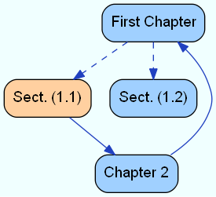

# MdGraphExtract

[![npm package][npm-img]][npm-url]
[![build status][travis-img]][travis-url]

> extracting a graph in [DOT] format from a [Markdown] file

_MdGraphExtract_ can be used as a [Gulp] plugin.

## Modes

_MdGraphExtract_ has two operational modes: Autograph mode and DotExtract mode.

### Autograph Mode `auto`

Extracts nodes and edges from headlines and internal links.

Example [Markdown] document:

~~~ Markdown
# First Chapter
Text with an internal link to [Section 1.1] and [Section 1.2].

## Section 1.1
This section references [Second Chapter][].

## Section 1.2
This section stands for its own.

# Second Chapter
And here is a link to [the first chapter][First Chapter].
~~~

Resulting [DOT] file:

~~~ DOT
digraph G {
    "First Chapter" [URL="#first-chapter"];
    "First Chapter" -> "Section 1.1";
    "First Chapter" -> "Section 1.2";
    "Section 1.1" [URL="#section-1.1"];
    "Section 1.1" -> "Second Chapter";
    "Section 1.2" [URL="#section-1.2"];
    "Second Chapter" [URL="#second-chapter"];
    "Second Chapter" -> "First Chapter";
}
~~~

Rendered with `dot` from [GraphViz]:

### DotExtract Mode `dotex`

Extracts [DOT] commands from HTML-comments under consideration of the last headline.

Example [Markdown] document:

~~~ Markdown
<!-- 
@graph MyGraph: bgcolor=azure
@graph-attributes rankdir=TB
@node-attributes fontname=Helvetica
@node-attributes shape=rect style="filled, rounded" fillcolor=#A0D0FF
@edge-attributes color=#2040C0
@node-type important: fillcolor=#FFD0A0
@edge-type weak: style=dashed
-->

# First Chapter
<!-- @node -->
<!-- @edge -> Section 1.1 <weak> -->
<!-- @edge -> Section 1.2 <weak> -->
Text paragraph is weakly linked with Section 1.1 and 1.2.

## Section 1.1
<!-- @node <important>: label="Sect. (1.1)" -->
<!-- @edge -> Second Chapter -->
This section is linked to the Second Chapter.

## Section 1.2
<!-- @node label="Sect. (1.2)" -->
This section stands for its own.

<!-- @node Second Chapter: label="Chapter 2" -->
<!-- @edge Second Chapter -> First Chapter -->
# Second Chapter
And the last chapter is linked with the first chapter.
~~~

Resulting [DOT] file:

~~~ DOT
digraph "MyGraph" {
    bgcolor=azure;
    rankdir=TB;
    node [fontname=Helvetica];
    node [fillcolor="#A0D0FF" shape=rect style="filled, rounded"];
    edge [color="#2040C0"];
    "First Chapter" [URL="#first-chapter"];
    "Section 1.1" [fillcolor="#FFD0A0" label="Sect. (1.1)" URL="#section-1.1"];
    "Section 1.2" [label="Sect. (1.2)" URL="#section-1.2"];
    "Second Chapter" [label="Chapter 2"];
    "First Chapter" -> "Section 1.1" [style=dashed];
    "First Chapter" -> "Section 1.2" [style=dashed];
    "Section 1.1" -> "Second Chapter";
    "Second Chapter" -> "First Chapter";
}
~~~

Rendered with `dot` from [GraphViz]:

It is possible to tag [DOT] commands with one or more group tags to build subsets of commands.
During the extraction process one or more groups can be selected to build a graph
with the specified subset of [DOT] commands.
Commands without a group tag are always selected.

A [DOT] command is taged by adding a hash character followed by a group name
without spaces after the command name.

During the extraction, the command group(s) are specified with the option `group`. 

If an edge is selected by the group(s), the two referenced nodes are
selected too, despite thier group tags.

Example Markdown document:

~~~ Markdown
# H1
<!-- @n -->
The node of this chapter is not tagged.

# H2
The node of this chapter is taged with group `A` and group `B`.
<!-- @n #A #B -->
The edge to *H1* is taged with group `A`.
<!-- @e #A -> H1 -->

# H3
The node of this chapter is taged with group `B`.
<!-- @n #B -->
The edge from *H1* to *H3* is taged with group `B`.
<!-- @e #B H1 -> H3 --> 

~~~

Resulting [DOT] file without a specified group:

~~~ DOT
digraph G {
    "H1" [URL="#h1"];
}
~~~

Resulting [DOT] file with group specified as `"A"`:

~~~ DOT
digraph G {
    "H1" [URL="#h1"];
    "H2" [URL="#h2"];
    "H2" -> "H1";    
}
~~~

## Interface

You can use _MdGraphExtract_ in any *Node.JS* project, but it has additional support for *Gulp*.

### Usage with Gulp

~~~ js
var gulp = require('gulp');
var spawn = require('gulp-spawn');
var mdgraphextract = require('mdgraphextract');

gulp.task('autograph', function() {
	// grab all Markdown files in the docs folder
	return gulp.src('docs/*.md')
		// pipe them to MdGraphExtract in Autograph mode, passing options
		.pipe(mdgraphextract({ mode: 'auto' }))
		// write the resulting *.gv files to the docs folder
		.pipe(gulp.dest('docs/'))
		// use `dot` from GraphViz to render the graphs into PNG files
		.pipe(spawn({
			cmd: 'dot',
			args: ['-Tpng'],
			filename: function(base, ext) { return base + '.png'; }
		}))
		// write the PNG files to the docs folder
		.pipe(gulp.dest('docs/'));
});
~~~

### Usage as a function

Additional to the main function, which processes *Vinyl* files and is usable in *Gulp* files, there is a simple asynchronous `extract()` function.

`extract(data[, opt], cb)`

Mini-Example with the `extract()` function:

~~~ js
var fs = require('fs');
var mdgraphextract = require('mdgraphextract');

var buffer = fs.readFileSync('test.md');
mdgraphextract.extract(buffer, 
    { encoding: 'utf8', mode: 'dotex' },
    function(result) {
        fs.writeFileSync('test.gv', result, { encoding: 'utf8' });
    });
~~~

The `extract()` function can take a string, a buffer, or a stream as input. The second argument with the options is optional. The encoding is `utf8` by default. The graph extraction mode is `auto` by default.

### Usage as a readable stream

At last _MdGraphExtract_ provides the pseudo-class `ExtractingStream`.

`new ExtractingStream(input[, opt])`

Mini-Example with the `ExtractingStream` pseudo-class:

~~~ js
var fs = require('fs');
var ExtractingStream = require('mdgraphextract').ExtractingStream;

var s = new ExtractingStream(fs.createReadStream('test.md', 'utf8'));
s.pipe(fs.createWriteStream('test.gv', 'utf8'));
~~~

The `ExtractingStream` pseudo-class is constructed with a `Readable` stream as input. The second argument with the options is optional.

### Options

The following options are available:

* The `mode` attribute controlles the operational mode of the graph extraction. It can have `"auto"` or `"dotex"` as value.
* The `encoding` attribute specifying the input encoding, in case the input is binary.
* The `group` attribute is recognized, if the `mode` is set to `"dotex"`, and specifies the command group(s) to consider. Either a string or an array of strings.
* The `autographLevel` attribute is recognized, if the `mode` is set to `"auto"`, and specifies the headline level to use as the link context. 
* The `noAutoRefs` attribute controlles the automatic generation of URL attributes for nodes from the auto-identifier of the related headline. If it set to `true`, no URL attributes will be auto-generated from the headlines. 
* The `refPrefix` can be set to a string, which will be prefixing any auto-generated URL attribute.

These are the default values for all options:

~~~ js
{
    "mode": "auto",
    "encoding": "utf8",
    "group": null,
    "autographLevel": null,
    "noAutoRefs": false,
    "refPrefix": ""
}
~~~

## License

_MdGraphExtract_ is published under the MIT license.

[npm-url]: https://www.npmjs.com/package/mdgraphextract
[npm-img]: https://img.shields.io/npm/v/mdgraphextract.svg
[travis-img]: https://img.shields.io/travis/mastersign/mdgraphextract/master.svg
[travis-url]: https://travis-ci.org/mastersign/mdgraphextract
[Gulp]: http://gulpjs.com
[Markdown]: https://daringfireball.net/projects/markdown/
[GraphViz]: http://www.graphviz.org
[DOT]: http://www.graphviz.org/content/dot-language
